# LMN-3-Build-Guide
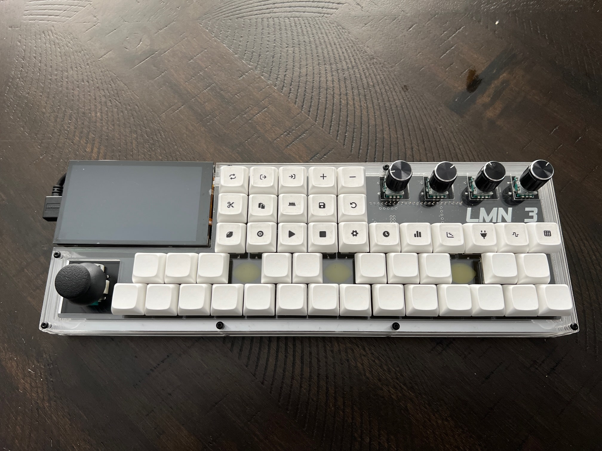

This repository contains the build guide for the LMN-3.

If you would like to support the project, please consider becoming a [sponsor](https://github.com/sponsors/stonepreston).

## Bill of Materials

| Description                | Model                            | Quantity | URL                                                                                            |
|----------------------------|----------------------------------|----------|------------------------------------------------------------------------------------------------|
| Diode                      | 1N4148                           | 49       | https://www.amazon.com/McIgIcM-1n4148-switching-Standard-Through/dp/B06XB1R2NK                 |
| Rotary Encoder             | EC11                             | 4        | https://www.amazon.com/WayinTop-Encoder-Potentiometer-Electronics-Projects/dp/B08728K3YB?psc=1 |
| Switch                     | 5 pin mechanical keyboard switch | 45       |                                                                                                |
| Joystick                   | COM-09032                        | 1        | https://www.sparkfun.com/products/9032                                                         |
| Keycap                    | Any                              | 45       |                                                                                                |
| Microcontroller            | Teensy 4.1                       | 1        | https://www.pjrc.com/store/teensy41.html                                                       |
| Raspberry Pi               | Raspberry Pi 4                   | 1        |                                                                                                |
| Screen                     | Hyperpixel 4                     | 1        | https://www.sparkfun.com/products/15357                                                        |
| USB to Mini USB Cable      | USB2AUB2RA1M                    | 1        | https://www.amazon.com/StarTech-com-Fiber-Optic-Cable-Multimode/dp/B012S11KV6                        |
| Raspberry Pi Power Adapter | 15W USB-C                        | 1        | https://www.raspberrypi.com/products/type-c-power-supply/ 
| Arduino Header Strip                    |                            | 2      | https://www.amazon.com/gp/product/B07PKKY8BX?psc=1                 |
| Printable Clear Sticker Paper         |                            | 1      | https://www.amazon.com/dp/B087CNQ75R?psc=1         |
| M2.5x30 Bolt          |                            | 8      |              |
| M2.5x12 Bolt          |                            | 4      |                 |
| M2.5 Nut        |                            | 8      |                 |
| Acrylic Sheet (12 inch x 16 inch x 1/8 inch)        |                            | 4      | https://www.amazon.com/dp/B09NNW15HQ?psc=1                 |
| Rubber Feet            |                            | 4      | https://www.amazon.com/dp/B08GLMTL77                |
| LMN-3 PCB            |                            | 1      | https://github.com/FundamentalFrequency/LMN-3-ECAD                |
| LMN-3 Case            |                            | 1      | https://github.com/FundamentalFrequency/LMN-3-MCAD                |

Note: In the BOM listed above, the quantity denotes the required number of that part, not necessarily the required number of whatever is linked in the URL. For example, you need 49 Diodes. The product linked is a pack of 100 diodes, so you just need 1 of those packs in order to have 49 diodes. I recommend getting extra diodes, switches, and encoders in case something ends up not working.

The links provided are simply the parts I used in my own build. If you can find the part somewhere else feel free to use that. The LMN-3-DAW has been tested on the 4 GB Raspberry Pi 4 only. Additionally, the Hyperpixel 4 screen also comes in a non touch version. The LMN-3-DAW does not rely on any touch capability, but the design of the touch-based Hyperpixel 4 looks WAY nicer than the non-touch version. The non-touch version is a little bit cheaper if you would like to keep costs down. The rubber feet are also not strictly necessary, but it's a nice touch. 

Please see the [LMN-3-MCAD repository](https://github.com/FundamentalFrequency/LMN-3-MCAD) for the CAM files for manufacturing the case itself. The acrylic sheets are only needed if you are going to laser-cut the case yourself. There are various online laser-cutting shops that allow you to submit DXF files and they will cut and ship you the parts. See the [LMN-3-ECAD repository](https://github.com/FundamentalFrequency/LMN-3-ECAD) for the gerber files for PCB manufacturing. These gerber files can be submitted to a board house for manufacturing the PCB.  

The keycaps I used in this build were blank XDA profile keycaps. You can use whichever you like, although the icons may need adjustment depending on the chosen profile. For the keycap icons please see the [LMN-3-Keycaps repository](https://github.com/FundamentalFrequency/LMN-3-Keycaps) where you will find the SVG file to be printed on the sticker paper. Note: I used a laser printer to print the icons onto the sticker paper. 

Some of the sections include running commands on your host machine. This is assumed to be a machine running a Debian-based Linux distribution and that the package manager is apt. Commands that look like this:

```
$ I am a command!
```

should be entered into a terminal command window. The `$` should not be included in the commands and just denotes the prompt. 

You will need a C/C++ compiler and git installed. You can install them with the following command:

```
$ sudo apt install build-essential git
```

You will also need to install [VSCode](https://code.visualstudio.com/). 

## Flashing the Teensy Firmware
First connect the microUSB cable to the Teensy, and then connect it to your computer. 

Clone the firmware repository to your host machine:
```
$ git clone https://github.com/FundamentalFrequency/LMN-3-Firmware.git
```

Open the repository in VSCode (you can use the code command assuming you have added it to your PATH, otherwise just open it via your application menu)
```
$ code ./LMN-3-Firmware
```

You should now have the firmware repository folder open in VSCode. You will need to install an extension. Press `ctrl+shift+x` to open the extensions menu. Search for `PlatformIO IDE` and install the PlatformIO extension. You will need to restart VSCode after installing it. Once it has restarted, you should see an ant-head icon in the left side-menu now. Click it, and it should bring up a project tasks panel. In the General folder you should see a Build task. Select that task and it should build the code. You will see a success message after it has finished. 

### Linux udev Rules
If you're attempting to upload the Teensy firmware from most Linux distributions, the process will fail to correctly communicate with the Teensy. This is because for security purposes, most Linux distributions prevent 2 way communication with random USB devices. In order to allow communication with the Teensy, a `udev` rule will need to be added to your system.

First, create a new rules file.
```
$ sudo nano /etc/udev/rules.d/00-teensy.rules
```

Then, paste the following contents into that file, and then save the file.
```
ATTRS{idVendor}=="16c0", ATTRS{idProduct}=="04*", ENV{ID_MM_DEVICE_IGNORE}="1", ENV{ID_MM_PORT_IGNORE}="1"
ATTRS{idVendor}=="16c0", ATTRS{idProduct}=="04[789a]*", ENV{MTP_NO_PROBE}="1"
KERNEL=="ttyACM*", ATTRS{idVendor}=="16c0", ATTRS{idProduct}=="04*", MODE:="0666", RUN:="/bin/stty -F /dev/%k raw -echo"
KERNEL=="hidraw*", ATTRS{idVendor}=="16c0", ATTRS{idProduct}=="04*", MODE:="0666"
SUBSYSTEMS=="usb", ATTRS{idVendor}=="16c0", ATTRS{idProduct}=="04*", MODE:="0666"
KERNEL=="hidraw*", ATTRS{idVendor}=="1fc9", ATTRS{idProduct}=="013*", MODE:="0666"
SUBSYSTEMS=="usb", ATTRS{idVendor}=="1fc9", ATTRS{idProduct}=="013*", MODE:="0666"
```

If the Teensy was already connected to your PC, make sure you unplug and re-plug the USB cable, and then communication should work as expected.

The build task was just a check to make sure you can compile the code (you should be able to with the build-essential package installed). To actually get the compiled code onto the Teensy, select the Upload task. It should attempt to connect to the teensy and automatically upload to it. You should see a small window pop up related to programming the Teensy. If it cannot program it automatically, you might need to press the small reset button on the Teensy to put it in the correct mode. You should also see a success message when this task finishes as well. 

## Soldering
Soldering the board is not very difficult. Just go slow and double check that things are correct before you go about soldering a row of components. Soldering the Teensy to the PCB is the most difficult part, as the pins are small and very close together. 

### Diodes
Begin by placing the first row of diodes on the board. Ensure you place the diodes in the correct orientation (the black end of the diode should match up with the line on the silkscreen). Place the entire row, then flip the board over.


Once youve got the board flipped over, try and ensure the diodes are flat against the board before you start soldering. Then solder all the leads:


After soldering, you can trim the leads:


Repeat this process until all the diodes are soldered to the board:


### Teensy
Once you have the diodes soldered, you need to solder the Teensy. If your Teensy did not come with headers soldered on, you will need to do that first:


Then place the Teensy on the board (it might take some finagling to get the pins through). Solder the pins and then trim them as short as you can get them. This is the most difficult part so go slow if you need to. 


### Switches 
Now its time to solder the switches (you should test your switches first with a multimeter to ensure they all work). You will need to place the acrylic witch layer over the top of the PCB first. Then, install the switches on top of the switch layer so that they are snug against the acrylic, with their pins going through the PCB. You may find it easier to place the switches around the corners first. Ensure each switch is seated tightly against the acrylic. 

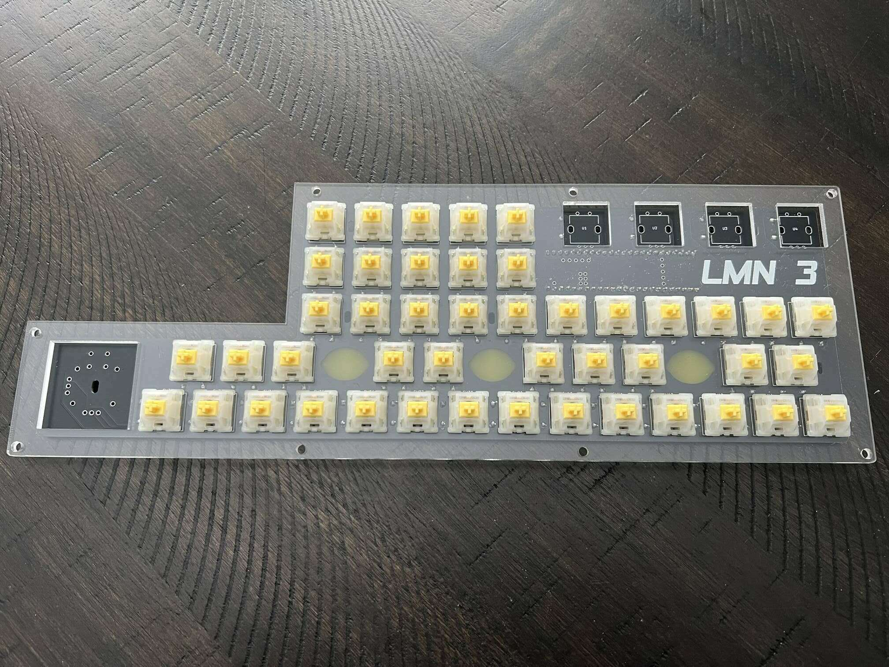

Also ensure all pins are going through the PCB:

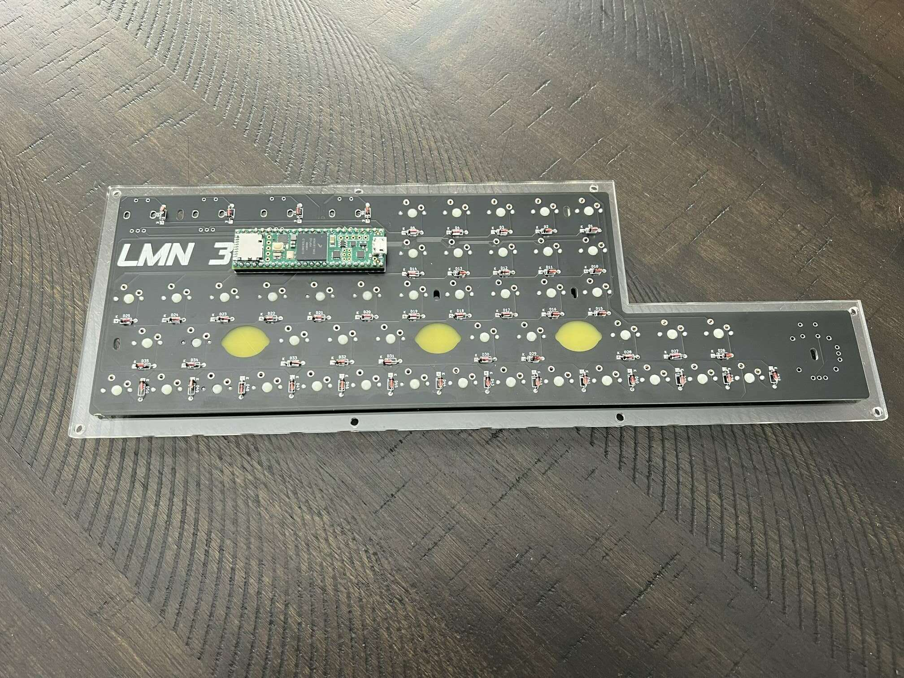

Once all the switches are placed, you can solder them:

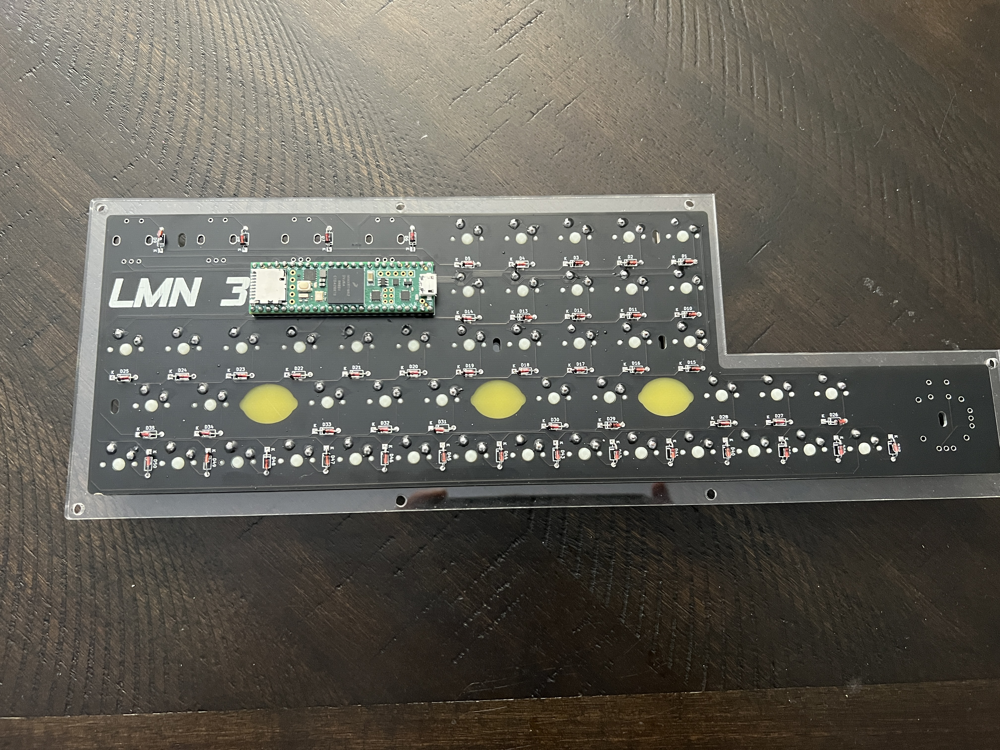


### Encoders and Joystick
The encoders and joystick are easy to solder. I found it easiest to place the encoders, flip the board over, and then let the board rest on the encoders, with a book or something on the bottom to support it while I soldered things in place. You might also try taping the encoders down so they don't move as much. I didnt have much trouble with the joystick moving. 

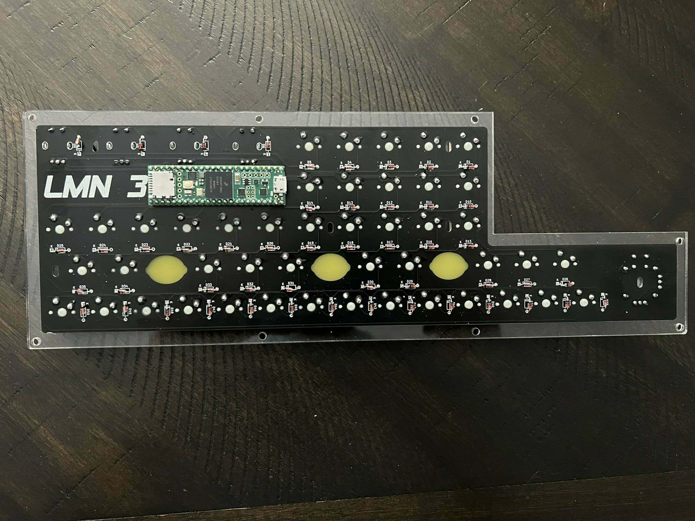

Once those are on the soldering is complete. If you want to, you can check to make sure everything works at this stage. Plug the Teensy back in your computer. You can download the x86-64 release of the LMN-3-DAW from the [releases page](https://github.com/FundamentalFrequency/LMN-3-DAW/releases), extract the files, and then run the LMN-3 application. You should be able to press the switches and turn the encoders, and see changes happening in the application running on screen. 

## Assembly

### Keycaps
Now is a good time to place the keycaps onto the switches. Try not to force anything, you don't want to crack the acrylic. As mentioned above, you can print the keycap icons on clear sticker paper, then cut them out and stick them on. You can find the icons in the [LMN-3-Keycaps repository](https://github.com/FundamentalFrequency/LMN-3-Keycaps)

### Case
Starting with the bottom layer, stack all the layers up on top of each other except for the switch layer. Note the two upper layers are a bit smaller on one side. 

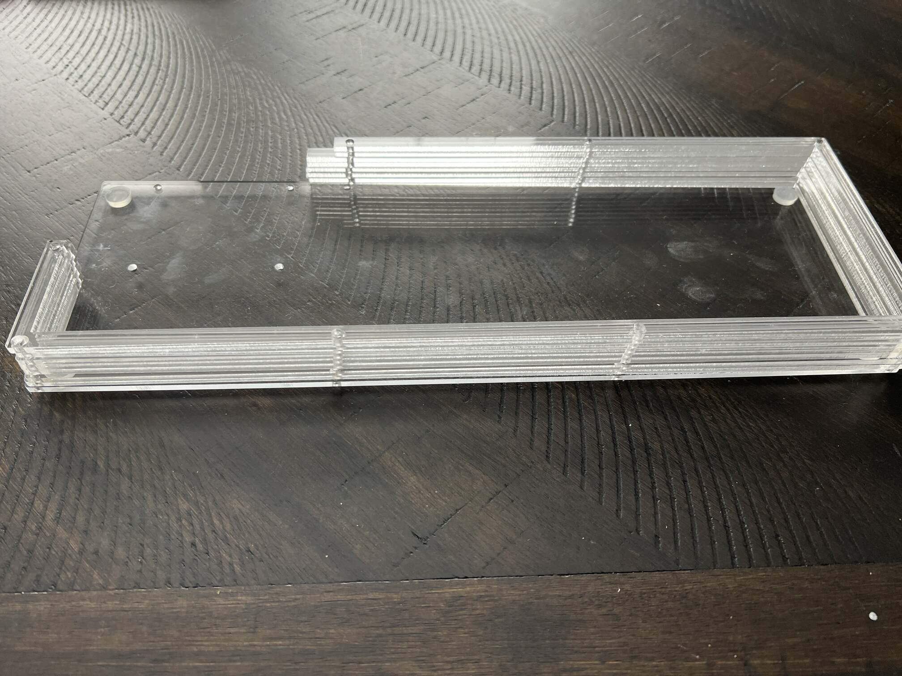

Go ahead and connect the microUSB cable to the Teensy. 

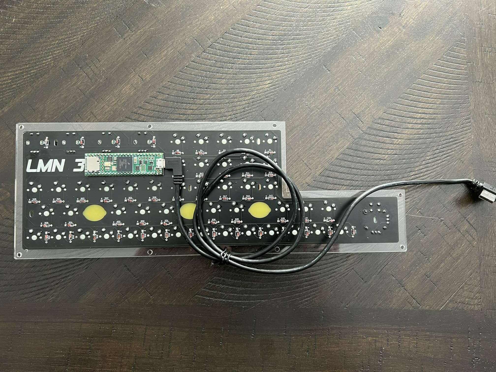

Then place the switch layer/PCB on the top of the stack:

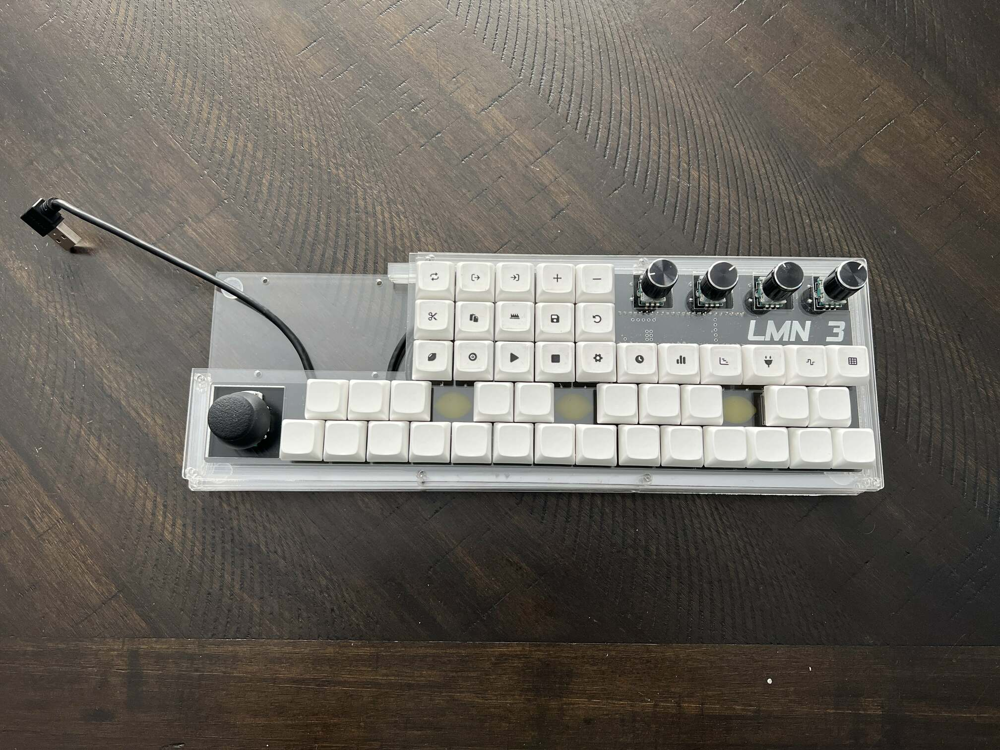

You can then stick 4 of the M2.5x30 bolts through the corner holes:

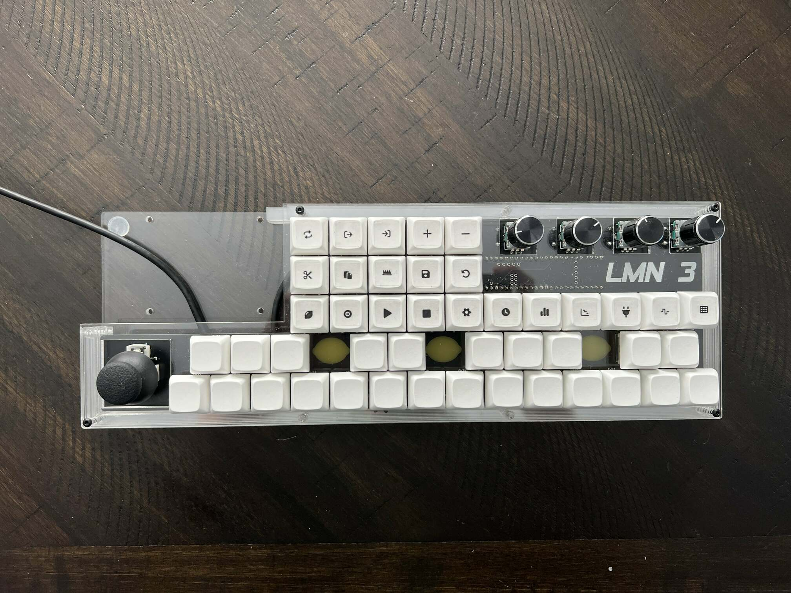

Tighten the nuts finger tight:

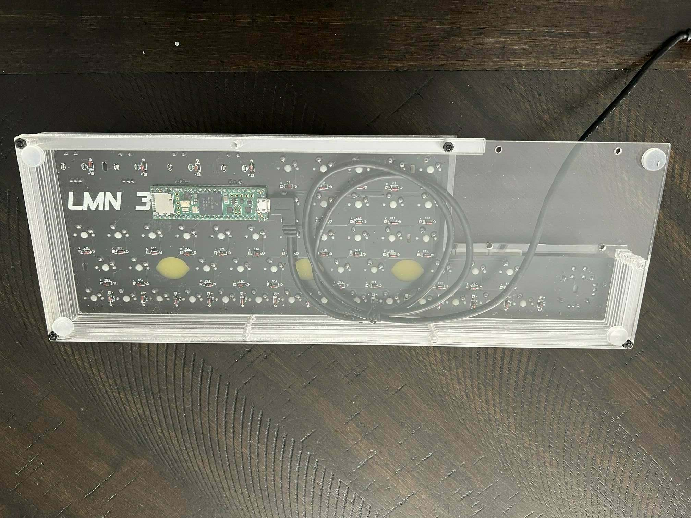

Repeat this process with the rest of the M2.5x30 bolts and nuts:

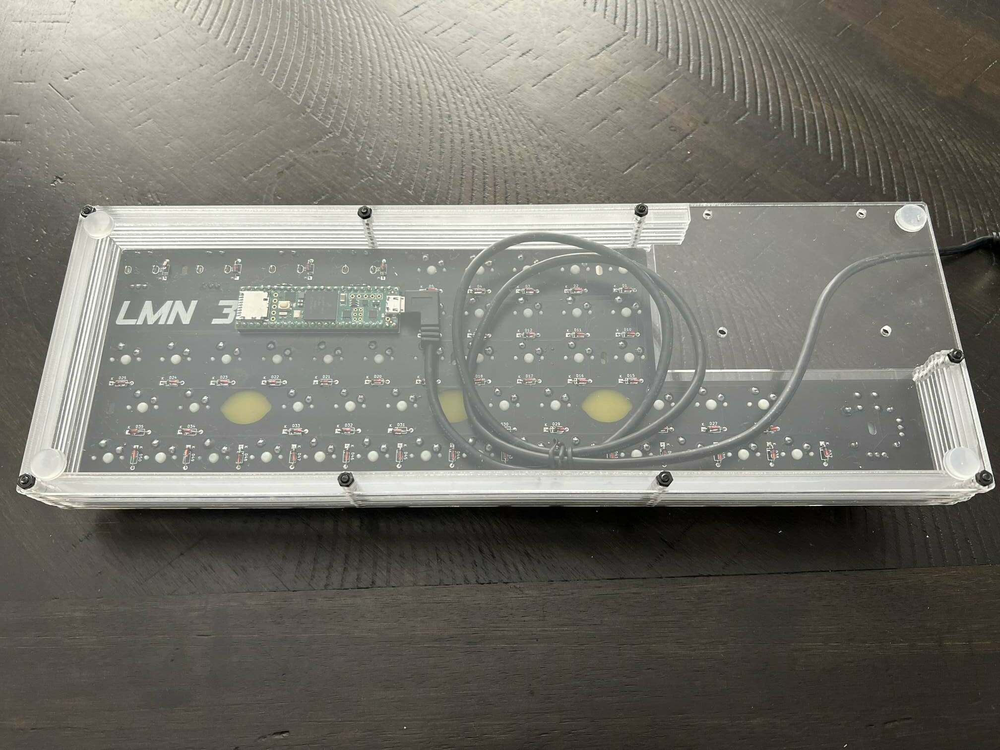

Connect the USB end of the cable to the pi, routing the cable through. You can route it between the post and the USB stack if you want, but it might strain the cable, so I just brought it around the post. 

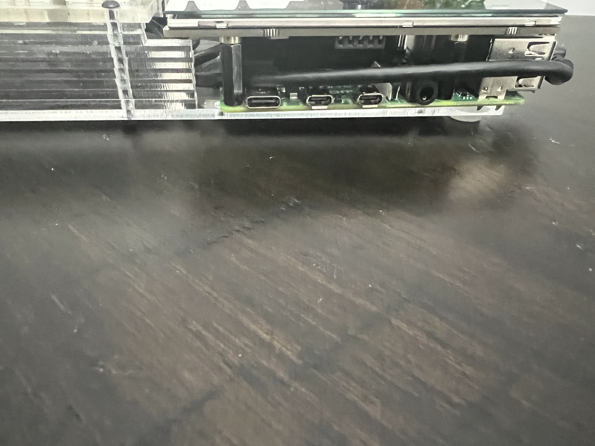

Place the Pi on the bottom layer, and then bolt it to the bottom of the case using the 4 M2.5x12 bolts:

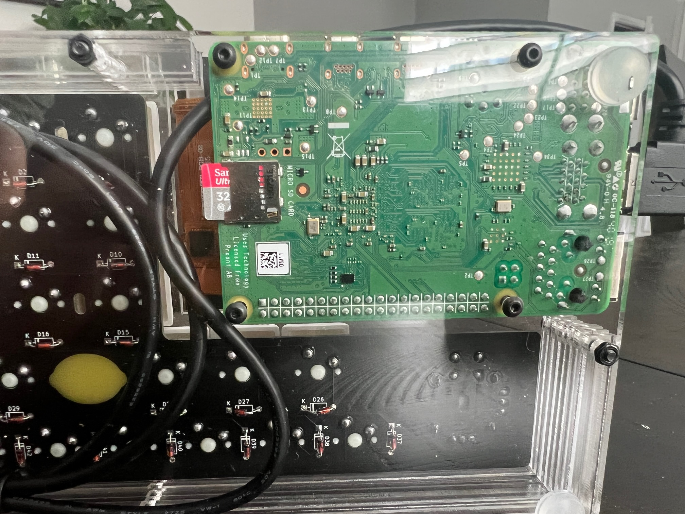

After that you are all done with assembly, and can move on to setting up the Pi.


## Rasbperry Pi Setup
The steps below assume you have a working Raspberry Pi 4 (running Bullseye) you can log into and use, and that the username for the account is pi. If your username is different, please make sure and make the correct subsitutions. It's also recommended you login to the pi via SSH, assuming you enabled it and filled in the network information when using the [Raspberry Pi Imager](https://www.raspberrypi.com/software/). Network connectivity is required to SSH into the Pi and download the LMN-3 DAW. You can use the advanced imager settings to configure the Pi to automatically start up and join the network.

### Connecting via SSH
On your host machine, find the IP of your pi: 

```
$ sudo arp-scan --interface=wlp3s0 --localnet
```
You may need to provide a different interface name. `$ ip link show` will show you your available interfaces. 

Find the item in the list that looks like this:
```
10.0.0.146	dc:a6:32:6d:a2:29	Raspberry Pi Trading Ltd
```
Then SSH into the pi:
```
$ ssh pi@10.0.0.146
```

Replace `10.0.0.146` with whatever the IP was for your device. Now you should be remotely connected to the Pi, and can execute commands inside on it in your terminal session.

### Downloading the LMN-3 DAW
```
$ cd ~
$ wget https://github.com/FundamentalFrequency/LMN-3-DAW/releases/download/v0.1.0/LMN-3-aarch64-linux-gnu.zip
```
The URL used above is for the aarch64 application. If you are using a different architecture you can find it [here](https://github.com/FundamentalFrequency/LMN-3-DAW/releases/tag/v0.1.0).

After downloading, unzip the archive.

```
$ unzip LMN-3-aarch64-linux-gnu.zip
```

You can run the app to make sure it runs. This will also create the config directory that is needed in the next step:
```
$ ./LMN-3
```
You should see some information printed to the console. Press `ctrl+c` to quit. 

### Hiding the application title bar
We need to hide the application title bar so that the application title and the buttons for minimise, maximise, and close dont appear. This is accomplished via configuration using the LMN-3 config file. The LMN-3 config directory is created when the application is first run, but we must create the config file ourselves:
```
$ nano ~/.config/LMN-3/config.yaml
```
Add the following text to the file to disable the title bar:
```
config:
  show-title-bar: false
```
Close the file and save using `ctrl+x`. 

### Starting the LMN-3 DAW application on startup
We need to run the application on startup. We need to add a bit of delay so things can initialise and will use a bash script to accomplish this. 
```
$ nano ~/LMN_start.sh
```
Add the following text to the script:
```
#!/bin/bash
sleep 2
/home/pi/LMN-3
```
Make it executable:
```
$ chmod +x ~/LMN_start.sh
```

Create an autostart directory:
```
$ mkdir ~/.config/autostart
```
Then you can use nano to create and edit a desktop file:
```
nano ~/.config/autostart/LMN-3.desktop
```
Add the following text:
```
[Desktop Entry]
Type=Application
Name=LMN-3
Exec=/home/pi/LMN_start.sh
```

Press ctrl+x to exit, and make sure and save the changes when prompted. 

### Configuring the screen

Open `/boot/config.txt`:
```
$ sudo nano /boot/config.txt
```

Add the following lines to the very end of the file:
```
dtoverlay=vc4-kms-dpi-hyperpixel4
dtparam=rotate=90,touchscreen-swapped-x-y,touchscreen-inverted-y
```
See the following [issue](https://github.com/pimoroni/hyperpixel4/issues/177) for more information on configuring the Hyperpixel screen. 

Now reboot the system:
```
sudo reboot
```
Once the system restarts, you should see that the application automatically started up and that the window decorations are gone. If the screen is rotated incorrectly, add a rotate line with the correct angle needed to orient it correctly. The top of the screen should be near the side of the Pi with the power and HDMI ports. 

### Hiding the Panel and Disabling Screen Blanking

We want to hide the main menu panel when its not being used. There is probably a way to configure this via the command line, but its easy enough to do with a mouse once you have the screen working. To do that, follow these instructions: 

`right click the menu -> Panel settings -> advanced -> check minimise panel when not in use and set size when minimzed to 0`

If you hover over the menu location it should unhide, and hide again when you move your mouse away from it. 

You can disable screen blanking using the UI as well:

`Press the Raspberry Pi start menu -> Raspberry Pi Configuration -> Display -> Disable Screen Blanking`

### Additional Configuration
At this point things are basically done. You can see the [LMN-3-DAW](https://github.com/FundamentalFrequency/LMN-3-DAW) README for information on additional configuration such as adding samples and custom drum kits. 
